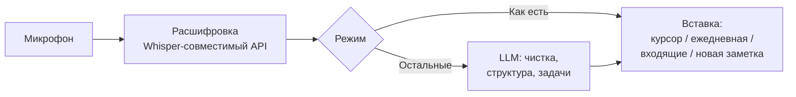

# Voice Scribe

Голосовой помощник для [Obsidian](https://obsidian.md): надиктовываете мысли, а плагин расшифровывает речь и с помощью LLM превращает её в чистый текст, структурированную заметку или список задач.

Нажали кнопку, говорите, нажали ещё раз. Через несколько секунд текст уже в заметке.



## Содержание

- [Возможности](#возможности)
- [Установка](#установка)
- [Быстрый старт](#быстрый-старт)
- [Выбор провайдера и стоимость](#выбор-провайдера-и-стоимость)
- [Как пользоваться](#как-пользоваться)
- [Команды](#команды)
- [Настройки](#настройки)
- [Ключи и приватность](#ключи-и-приватность)
- [Если что-то не работает](#если-что-то-не-работает)
- [Разработка](#разработка)
- [Выпуск релиза](#выпуск-релиза)

## Возможности

| Функция | Описание |
|---|---|
| Диктовка | Старт и стоп записи кнопкой в левой панели, командой или горячей клавишей. В статус-баре идёт таймер, иконка краснеет. |
| Режимы обработки | Как есть, чистый текст, структурированная заметка (заголовок, суть, список, задачи), только задачи, свой промпт. |
| Голосовые команды | Выделите текст и скажите «сделай короче», «переведи на английский», «исправь ошибки». Без выделения: «напиши приветствие клиенту». |
| Куда вставлять | В курсор, в конец ежедневной заметки (с временем), в файл «Входящие», в новую заметку (с заголовком в имени и свойствами). |
| Файлы | Расшифровка аудиофайлов из хранилища (mp3, m4a, wav, webm, ogg, flac), до 25 МБ. |
| Страховка | Если сервис недоступен, запись сохраняется в хранилище. Если не ответила только LLM, вставляется сырая расшифровка. |
| Провайдеры | OpenAI, Groq, Google Gemini, Anthropic Claude (только обработка текста) и любой локальный сервер с OpenAI-совместимым API. |
| Ключи | Хранятся в отдельном файле `.env`, а не в `data.json`. |

## Установка

Плагин пока не входит в каталог сообщества Obsidian, поэтому ставится вручную или через BRAT.

### Способ 1: готовые файлы из релиза

1. Скачайте из раздела [Releases](../../releases) три файла: `main.js`, `manifest.json`, `styles.css`.
2. Откройте папку своего хранилища. В Obsidian это можно сделать так: `Ctrl/Cmd+P`, затем «Show vault in system explorer».
3. Создайте папку `.obsidian/plugins/voice-scribe/` (она скрытая: в Windows включите «Показывать скрытые элементы», на macOS нажмите `Cmd+Shift+.`).
4. Положите туда три файла. Должно получиться:
   ```
   <хранилище>/.obsidian/plugins/voice-scribe/main.js
   <хранилище>/.obsidian/plugins/voice-scribe/manifest.json
   <хранилище>/.obsidian/plugins/voice-scribe/styles.css
   ```
   Название папки должно совпадать с `id` в `manifest.json`: `voice-scribe`. Файлы лежат прямо в ней, без вложенных папок.
5. Перезапустите Obsidian.
6. «Настройки → Сторонние плагины»: выключите «Безопасный режим», найдите **Voice Scribe** и включите.

### Способ 2: через BRAT

1. Установите плагин [BRAT](https://github.com/TfTHacker/obsidian42-brat) из каталога сообщества.
2. В BRAT нажмите «Add Beta plugin» и вставьте адрес этого репозитория.
3. Включите Voice Scribe в списке сторонних плагинов.

Для этого способа в репозитории должен быть релиз с файлами `main.js`, `manifest.json` и `styles.css` (см. [Выпуск релиза](#выпуск-релиза)).

### Способ 3: из исходников

```bash
git clone https://github.com/1337Dany/voice-scribe.git
cd voice-scribe
npm install
npm run build
```

Скопируйте `main.js`, `manifest.json` и `styles.css` в `.obsidian/plugins/voice-scribe/` и включите плагин, как в способе 1.

### Телефон

Скопируйте папку `voice-scribe` в `.obsidian/plugins/` хранилища на телефоне. Для этого подойдут «Файлы» на iOS, файловый менеджер на Android или синхронизация хранилища. При первой записи разрешите доступ к микрофону. Файл `.env` с ключами на каждом устройстве свой, ключи на телефоне вводятся заново (подробнее в разделе [Ключи и приватность](#ключи-и-приватность)).

## Быстрый старт

Нужны два ключа: для расшифровки речи и для обработки текста. Самый простой вариант: **Groq** для расшифровки и **Google Gemini** для обработки.

1. Создайте ключ Groq на [console.groq.com/keys](https://console.groq.com/keys).
2. Создайте ключ Gemini в [Google AI Studio](https://aistudio.google.com/apikey).
3. Откройте «Настройки → Voice Scribe».
4. Блок **«Расшифровка речи»**: «Готовый вариант» → Groq, вставьте ключ, нажмите «Проверить». Должно появиться ✅.
5. Блок **«LLM (обработка текста)»**: «Готовый вариант» → Google Gemini, вставьте ключ в поле «API-ключ LLM», нажмите «Проверить LLM». Снова ✅.
6. «Настройки → Горячие клавиши»: введите `Voice Scribe` и назначьте клавиши на «Диктовка» и «Голосовая команда».
7. Откройте заметку, нажмите иконку микрофона слева, скажите фразу и нажмите ещё раз.

Один ключ Groq тоже работает на всё: расшифровка и обработка текста через Llama. Для этого в блоке LLM выберите готовый вариант Groq и оставьте включённым «Тот же ключ…».

Названия моделей в настройках можно менять. Провайдеры периодически выпускают новые, а старые отключают.

## Выбор провайдера и стоимость

Условия провайдеров меняются, поэтому перед использованием проверьте их на сайте. Ниже то, что я смотрел в документации на момент написания.

| Провайдер | Расшифровка | Обработка текста | Заметки |
|---|---|---|---|
| Groq | да | да | Бесплатный план есть. Для Whisper лимит 20 запросов в день и 28 800 секунд звука в день. |
| OpenAI | да | да | Платный. |
| Google Gemini | нет | да | Есть бесплатный уровень. На нём Google может использовать запросы для улучшения своих продуктов. |
| Anthropic Claude | нет | да | Отдельный платный API-ключ из [консоли разработчика](https://platform.claude.com/). Подписка Claude Pro и Max API не включает, а использовать её учётные данные в сторонних приложениях нельзя. |
| Локальный сервер | да | да | Ollama, LM Studio, whisper.cpp и другие с OpenAI-совместимым API. Ключ не нужен. На телефоне `localhost` недоступен, нужен адрес сервера. |

Любой другой сервис с OpenAI-совместимым API подключается вручную через поля Base URL и «Модель».

## Как пользоваться

**Диктовка**

1. Откройте заметку и поставьте курсор.
2. Нажмите иконку микрофона слева или горячую клавишу. В статус-баре пойдёт таймер.
3. Говорите. Нажмите ещё раз, чтобы закончить.
4. Через несколько секунд («расшифровка…», затем «обработка…») текст появится в курсоре.

Совсем короткие записи (меньше 0,6 секунды) плагин пропускает. Команда «Отменить запись» выбрасывает запись без отправки.

**Голосовая команда**

1. Выделите текст (или просто поставьте курсор).
2. Запустите команду «Голосовая команда: начать / остановить запись».
3. Скажите, что сделать: «сделай короче», «переведи на английский», «оформи списком».
4. Запустите команду ещё раз. Выделенный текст заменится результатом. Если ничего не выделено, текст появится в курсоре.

Голосовые команды работают только при включённой LLM.

**Режимы обработки**

| Режим | Что делает |
|---|---|
| Как есть | Только расшифровка, без LLM. |
| Чистый текст | Расставляет пунктуацию, убирает слова-паразиты и повторы, делит на абзацы. Смысл и стиль не меняет. |
| Структурированная заметка | Заголовок, суть, список главного, задачи. |
| Только задачи | Чек-лист вида `- [ ] задача`. |
| Свой промпт | Ваша инструкция, например «Оформи как протокол встречи с решениями и ответственными». |

**Куда вставляется текст**

| Вариант | Результат |
|---|---|
| В курсор | Текст появляется в открытой заметке. Если заметку закрыли или переключились на другую, текст уходит во «Входящие», ничего не пропадает. |
| В ежедневную заметку | В конец файла добавляется блок с временем. Формат имени файла настраивается. |
| Во «Входящие» | Все записи дописываются в один файл. |
| В новую заметку | Отдельный файл с датой и заголовком в имени, со свойствами (дата, источник, тег). |

**Расшифровка готового файла.** Команда «Расшифровать аудиофайл из хранилища» показывает аудио из хранилища, вы выбираете файл, а текст вставляется так же, как при диктовке. Так же можно расшифровать запись, сохранённую после сбоя.

## Команды

Все команды доступны через палитру (`Ctrl/Cmd+P`) и назначаются на горячие клавиши.

| Команда | Что делает |
|---|---|
| Диктовка: начать / остановить запись | Основная команда. |
| Голосовая команда: начать / остановить запись | Запись инструкции для LLM. |
| Отменить запись | Прекращает запись без отправки. |
| Расшифровать аудиофайл из хранилища | Расшифровывает выбранный файл. |
| Выбрать режим обработки текста | Быстрая смена режима. |
| Выбрать, куда вставлять текст | Быстрая смена места вставки. |

## Настройки

| Раздел | Что можно настроить |
|---|---|
| Расшифровка речи | Готовый вариант, Base URL, ключ, модель, язык (`ru`, `en`, пусто для автоопределения), словарь редких слов и имён, кнопка проверки. |
| LLM | Включить или выключить, готовый вариант, Base URL, ключ (общий или отдельный), модель, температура, кнопка проверки. |
| Поведение | Режим обработки, свой промпт, куда вставлять, сохранять ли исходную расшифровку, максимальная длина записи (1–120 минут). |
| Куда сохранять | Файл «Входящие», папка и формат имени новых заметок, свойства и тег, папка и формат имени ежедневной заметки, формат времени. |
| Страховка | Сохранять ли запись при ошибке, хранить ли аудио всех записей, папки для них. |

Формат даты в именах поддерживает `YYYY`, `YY`, `MM`, `DD`, `HH`, `mm`, `ss`. Текст в квадратных скобках остаётся как есть: `[Заметка] YYYY-MM-DD`.

## Ключи и приватность

- Звук и текст уходят только выбранному вами провайдеру (или вашему локальному серверу). Больше никуда.
- API-ключи хранятся в файле `.env` в папке плагина: `.obsidian/plugins/voice-scribe/.env`. Плагин создаёт и обновляет его сам, когда вы вводите ключи в настройках. Формат смотрите в [`.env.example`](.env.example).
- В `data.json` ключей нет, только обычные настройки. Поэтому `data.json` в этом репозитории можно использовать как шаблон настроек по умолчанию.
- `.env` лежит на каждом устройстве отдельно. Через Git или синхронизацию он может не переехать, и на телефоне ключи вводятся заново.
- Ключи хранятся открытым текстом. Не публикуйте и не коммитьте `.env`. Если ключ мог попасть в чужие руки, перевыпустите его в консоли провайдера.
- Если вы обновляетесь с версии, где ключи лежали в `data.json`, они перенесутся в `.env` автоматически при первом запуске.
- Если плагин не смог записать `.env`, он один раз предупредит вас. Ключ будет работать до перезапуска и не попадёт в `data.json`.

## Если что-то не работает

| Сообщение или симптом | Что делать |
|---|---|
| «Нет доступа к микрофону» | macOS: «Системные настройки → Конфиденциальность и безопасность → Микрофон», включить Obsidian и перезапустить. Windows: «Параметры → Конфиденциальность → Микрофон», разрешить классическим приложениям. Телефон: разрешения приложения. |
| «Ключ API отклонён» | Проверьте ключ и что Base URL соответствует провайдеру. Кнопки «Проверить» в настройках покажут точную причину. |
| «Не найден адрес API или модель» | Проверьте Base URL (для Groq и OpenAI с `/v1` на конце) и название модели. Если провайдер сменил названия, впишите актуальное. |
| «Превышен лимит запросов…» | Закончился лимит или баланс. Для бесплатного Groq это 20 расшифровок в день. |
| «Запись сохранена: …» | Сервис был недоступен, звук лежит в хранилище. Позже запустите «Расшифровать аудиофайл из хранилища» и выберите этот файл. |
| «LLM не ответила, вставил расшифровку как есть» | Расшифровка прошла, не ответила только LLM. Текст не потерян, обработайте его вручную. |
| Плагина нет в списке | Проверьте путь `.obsidian/plugins/voice-scribe/manifest.json`, выключите «Безопасный режим», перезапустите Obsidian. |
| Ключи пропали после синхронизации | `.env` не синхронизируется между устройствами, введите ключи заново в настройках. |

Для диагностики откройте консоль: `Ctrl+Shift+I` (на Mac `Cmd+Option+I`). Сообщения плагина начинаются с `[Voice Scribe]`. Если открываете issue, приложите текст ошибки и не публикуйте ключи.

## Разработка

Нужен Node.js 20 или новее (проверялось на версии 22).

```bash
npm install
npm run dev        # сборка с отслеживанием изменений
npm run build      # проверка типов и production-сборка main.js
npm test           # автотесты
npm run template   # пересоздать data.json (шаблон настроек без ключей)
```

Проверить плагин в работе удобно так: склонируйте репозиторий прямо в `.obsidian/plugins/voice-scribe/` тестового хранилища и запустите `npm run dev`.

Структура:

| Файл | За что отвечает |
|---|---|
| `src/main.ts` | Плагин: команды, запись, вставка в заметки, загрузка и сохранение настроек. |
| `src/api.ts` | Клиент для OpenAI-совместимых API (расшифровка и чат), разбор ошибок. |
| `src/multipart.ts` | Сборка `multipart/form-data` для загрузки аудио. |
| `src/recorder.ts` | Запись с микрофона. |
| `src/pipeline.ts` | Цепочка: расшифровка, затем LLM, с запасным вариантом при сбое LLM. |
| `src/prompts.ts` | Промпты для режимов и голосовых команд. |
| `src/format.ts` | Даты, имена файлов, заголовки, правила вставки текста. |
| `src/secrets.ts` | Чтение и запись `.env`. |
| `src/settings.ts`, `src/settingsTab.ts` | Настройки и экран настроек. |
| `test/` | Юнит-тесты и сквозные тесты с имитацией Obsidian и локальным сервером. |

Тесты проверяют логику плагина на имитации Obsidian. Работу в настоящем Obsidian на разных платформах нужно проверять вручную.

## Выпуск релиза

В релиз кладутся ровно три файла: `main.js`, `manifest.json`, `styles.css`. Файл `data.json` в релиз не добавляйте, чтобы обновление не затёрло настройки пользователей.

1. Поднимите версию в `manifest.json` и `package.json`.
2. Соберите плагин и прогоните тесты: `npm run build && npm test`.
3. Создайте релиз с тегом, совпадающим с версией:
   ```bash
   git tag 1.2.0
   git push origin 1.2.0
   gh release create 1.2.0 main.js manifest.json styles.css --title "1.2.0" --notes "Описание изменений"
   ```
